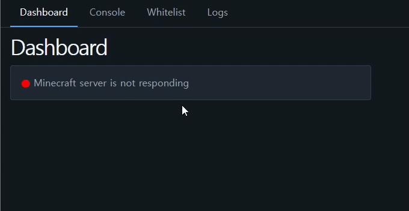
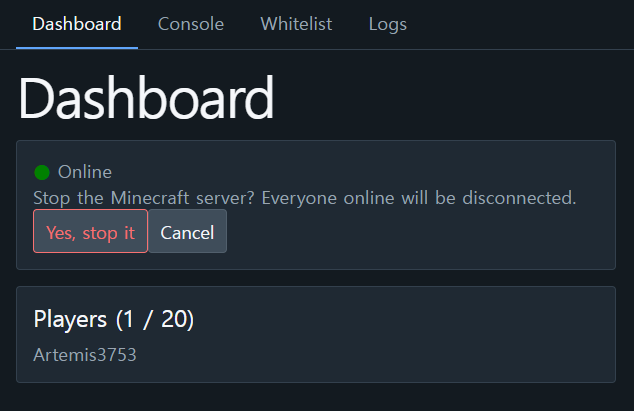
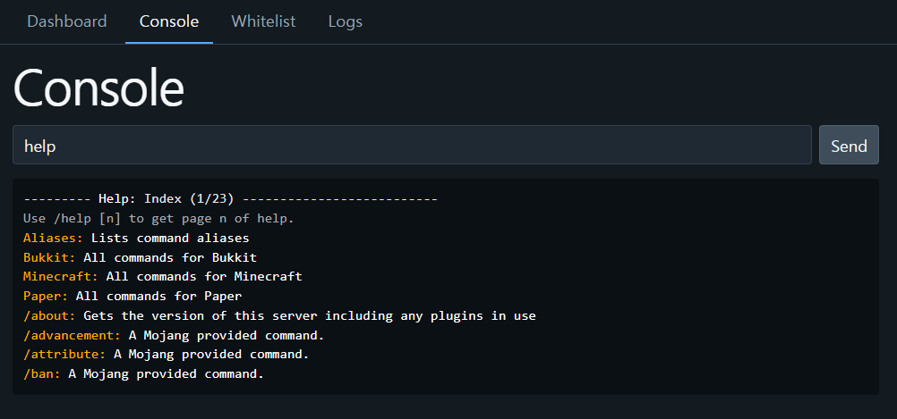
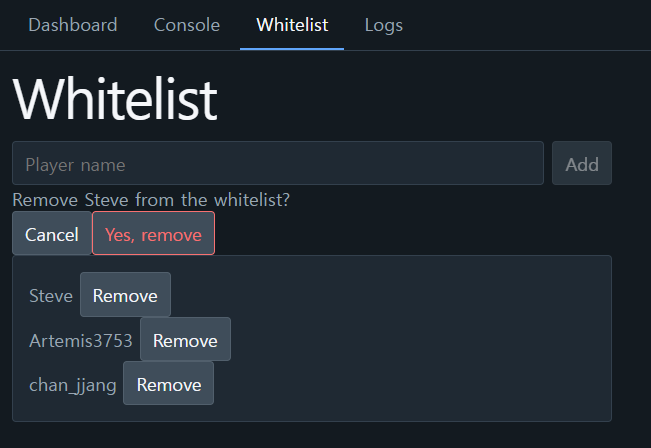
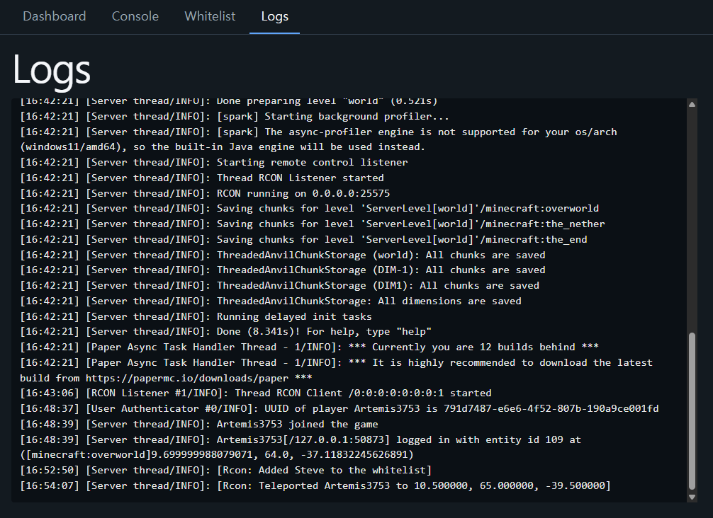

# Minecraft Server Companion

A web-based dashboard for monitoring and managing a Minecraft (Paper) server remotely via RCON.

I was always interested in running Minecraft servers as a teenager. I managed a
server for 10 to 15 players, and it meant I had to sit at the PC with a console
open. This was pretty inconvenient because I had to be home to manage it — I
might be out hanging out with my friends or getting dinner with my family, and I
remember times when I wanted to do both but couldn't. So I made a companion app
that lets me manage the server from anywhere. This project also helped me
practice full-stack design.

## Status

✅ Complete — the MVP scope in [`docs/PRD.md`](docs/PRD.md) is done, and every
endpoint is verified against a live Paper server.

## Demo

**Dashboard** — whether the server is up, and who is connected. It asks the server
every ten seconds, so when the server comes back it turns green on its own. Nothing
below was clicked; the cursor does not move.



**Stopping the server takes two steps.** No destructive action is a single click.



**Console** — any command RCON accepts, with Minecraft's `§` colour codes rendered as colour.



**Whitelist** — list, add, remove. Removing asks first, the same way stopping does.



**Logs** — the last 500 lines of `latest.log`, polled every 5 seconds.



## Why there is no live URL

I chose not to deploy this publicly: as the code stands there is no HTTPS, no
limit on login attempts, and tokens never expire. Reaching this back end at all
is full control of the Minecraft server, so it runs locally. There is a
[recorded walkthrough](https://youtu.be/STs8S6lfzRQ) instead — the reasoning is
in [`docs/PRD.md`](docs/PRD.md).

## Features

- Authentication with a single shared password
- Server online/offline status and the connected players list
- Stop the server, behind a confirmation step
- Console — send any RCON command and read the reply
- Whitelist management: list, add, remove
- Log viewer

## Tech Stack

- **Frontend**: React, Vite, React Router
- **Backend**: Node.js, Express
- **Protocol**: RCON (Minecraft Paper server)

## Setup

### Prerequisites

- **Node.js 20 or newer.** The start script uses `node --env-file`, which older
  versions do not support. Developed on v24.19.0.
- **A Paper (or Spigot/Vanilla) Minecraft server with RCON enabled.** In its
  `server.properties`:

  ```
  enable-rcon=true
  rcon.port=25575
  rcon.password=<something>
  ```

  RCON only takes effect after the Minecraft server restarts.

### Install

`client/` and `server/` have separate dependencies, so both need installing.

```bash
cd server
npm install
```

```bash
cd client
npm install
```

### Configure

Both sides read a `.env`, and neither is committed.

#### `server/.env`

Copy `server/.env.example` and fill in all seven keys:

| Key | Where it comes from |
| --- | --- |
| `PORT` | Port for this back end. `3001` if you have no reason to change it |
| `RCON_HOST` | Host running the Minecraft server — `localhost` if it is the same machine |
| `RCON_PORT` | `rcon.port` from the Minecraft server's `server.properties` |
| `RCON_PASSWORD` | `rcon.password` from that same file |
| `DASHBOARD_PASSWORD` | Your own choice — the password for logging into this dashboard |
| `MINECRAFT_LOG_PATH` | Full path to the Minecraft server's `latest.log`, including the filename — typically `<server directory>/logs/latest.log` |
| `CORS_ALLOWED_ORIGIN` | Where the front end is served from — `http://localhost:5173` for the Vite dev server |

#### `client/.env`

Copy `client/.env.example` and fill in the one key:

| Key | Where it comes from |
| --- | --- |
| `VITE_API_BASE_URL` | Where the back end listens — `http://localhost:3001` by default |

**`DASHBOARD_PASSWORD` and `RCON_PASSWORD` are deliberately separate, and the
RCON one must never reach a browser** — anyone holding it can connect straight to
the RCON port and issue `stop`, bypassing this dashboard and its confirmation
step entirely.

`.env` is gitignored and must stay that way. `.env.example` carries key names
only, never values. Why these keys are shaped the way they are is in
[`docs/API.md`](docs/API.md#configuration).

### Run

Two processes, one per half. Both stay running.

```bash
cd server
npm start
```

```bash
cd client
npm run dev
```

The back end listens on `PORT` (default `3001`). Check that it is up:

```bash
curl http://localhost:3001/api/health
```

The front end is served at `http://localhost:5173`. It needs the back end to be
running for anything past the Login screen; the back end itself starts fine
without the Minecraft server.

Both processes read their `.env` once at startup, so editing either file means
restarting that process.

## Documentation

- [`docs/API.md`](docs/API.md) — the HTTP contract, endpoint by endpoint, and
  why each status code and payload key was chosen.
- [`docs/PRD.md`](docs/PRD.md) — scope, screens, structure, and the reasoning
  behind each technical decision.
